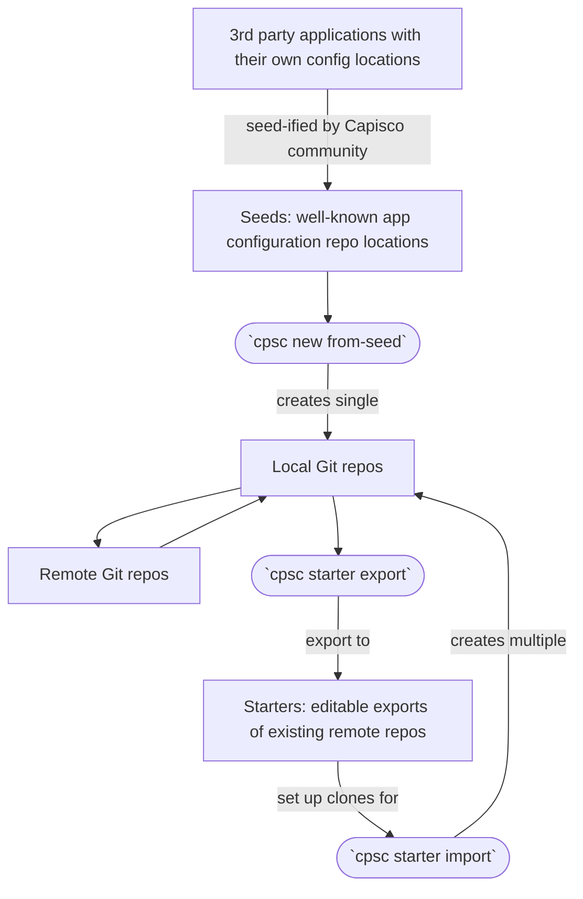

```mermaid
flowchart TD
    seeds[Seeds: well-known app configuration repo locations];
    starter[Starters: editable exports of existing remote repos];

    local_repos[Local Git repos]
    remote_repos[Remote Git repos];

    local_repos --> remote_repos;
    remote_repos --> local_repos;

    command_new_from_file([`cpsc new from-seed`]);
    command_import([`cpsc starter import`]);
    command_export([`cpsc starter export`]);

    command_new_from_file -->|creates single| local_repos;
    command_import -->|creates multiple| local_repos;

    seeds --> command_new_from_file;
    local_repos --> command_export;
    
    command_export -->|export to| starter;
    starter -->|set up clones for| command_import;

    apps[3rd party applications with their own config locations] -->|seed-ified by Capisco community| seeds;
```
